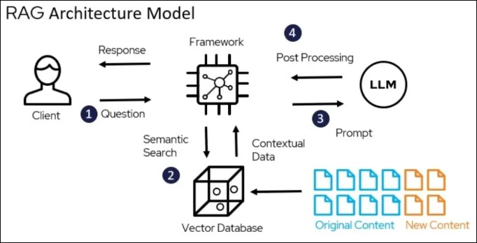
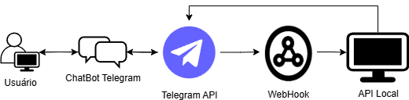
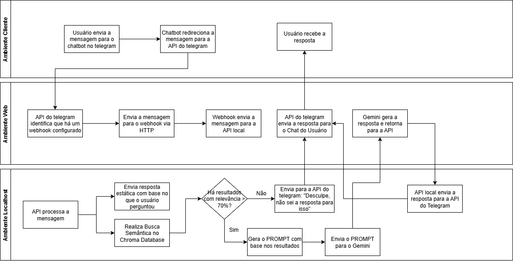

# InclusionAIAgent

## 📌 Descrição

O **InclusionAIAgent** é um chatbot voltado para **educação inclusiva**, com foco em apoiar **pais, professores e coordenadores** na busca de informações confiáveis sobre crianças com **altas habilidades ou superdotação**.  
Ele utiliza técnicas de **IA generativa** combinadas com **recuperação de conhecimento especializado** para fornecer respostas contextualizadas, referências oficiais e materiais de apoio.

---

## 🏛 Arquitetura

### 🔹 Arquitetura do ChatBot

O projeto adota o modelo de **Recuperação Aumentada por Geração (RAG)**, que combina:

- **Base de conhecimento local** (documentos e artigos em ChromaDB)
- **Modelo generativo (Gemini)** para enriquecer e personalizar as respostas

Exemplo do modelo RAG:  

---

### 🔹 Arquitetura da Aplicação

O fluxo da aplicação integra **Telegram**, **API própria** e **Google Gemini**, orquestrados em uma arquitetura escalável:  

---

### 🔹 Fluxograma do Projeto

Fluxo simplificado da comunicação entre usuário, chatbot e modelo de IA:  

---

## 🛠 Tecnologias Utilizadas

- **Python** → linguagem principal da aplicação
- **FastAPI** → framework para criação da API
- **Google Gemini** → modelo de IA generativa
- **Telegram API** → integração do chatbot
- **LangChain** → orquestração do fluxo de IA
- **ChromaDB** → banco vetorial para recuperação de contexto
- **NGROK** → exposição segura do webhook local para a web
- **PyPDF** → processamento de documentos em PDF

---

## 🚀 Objetivo

Fornecer um **assistente inteligente, acessível e confiável**, capaz de apoiar a comunidade educacional com **informações práticas, baseadas em evidências e legislação oficial**, promovendo inclusão e valorização das altas habilidades.
